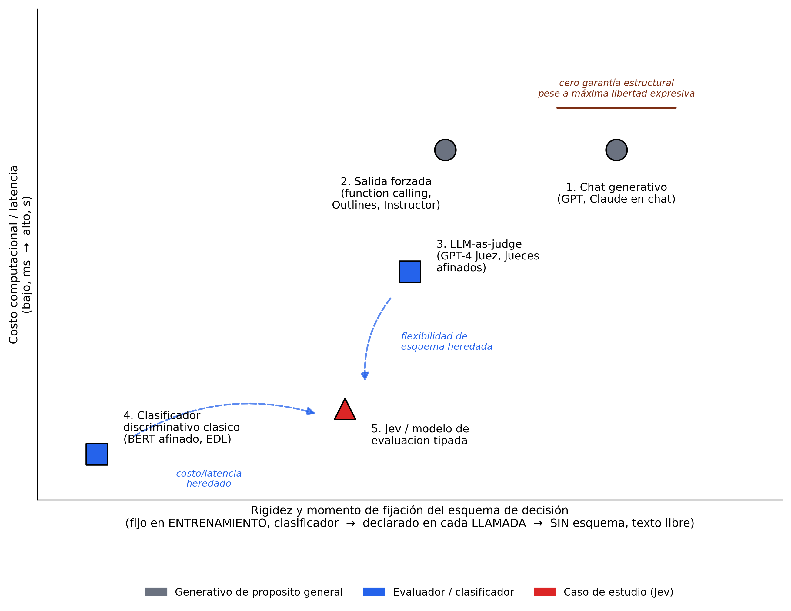

# Modelos de evaluación tipada y el colapso entre conflicto e ignorancia: un estudio de caso sobre Jev

**Maikel Leyva-Vázquez**¹,²,³

¹ Universidad Bernardo O'Higgins (UBO), Santiago, Chile. ² Universidad Bolivariana del Ecuador (UBE), Guayaquil, Ecuador. ³ Universidad de Guayaquil, Guayaquil, Ecuador.

*Borrador v0.3 — destino: NCML. Nota de campo, no línea Q1 propia. Revisión aplicada tras ronda adversarial de 5 modelos y dos experimentos de seguimiento (Choice enriquecido, Choice binario). Actualización 19-sep-2026: caso AGREE-REFUTE completado en los tres experimentos tras resolver el límite de tasa (§8); añadido Experimento 4 exploratorio (tipo Score, determinación graduada). Actualización 20-sep-2026: añadido Experimento 5 (composición μ/λ, reconstrucción del par independiente de LPA2v).*

---

## Resumen

Los modelos de chat basados en LLM devuelven texto libre que debe interpretarse; una categoría de herramientas que emergió en septiembre de 2026, los *modelos de evaluación tipada* ("System One models"), devuelven en su lugar un objeto tipado directamente utilizable por software. Jev (TypeSafe AI, reportado por el fabricante como lanzado el 15 de septiembre de 2026) es el primer ejemplo comercial de esta categoría. Este trabajo lo ubica dentro de un panorama de cinco categorías de interacción con modelos de IA y examina, con un experimento mínimo, una predicción derivada de la teoría de decisión anotada: que una salida colapsada a una sola probabilidad calibrada no puede distinguir *conflicto genuino* de *ignorancia genuina*. Para el tipo de pregunta más simple de Jev (`boolean`/Noul), el experimento es consistente con esa predicción: los casos de conflicto (probabilidad 0,50–0,57) y de ignorancia (0,46–0,48) caen en la misma banda estrecha, indistinguibles sin más contexto. Pero un segundo experimento, con el tipo `Choice` del mismo modelo y un esquema que nombra explícitamente "evidencia en conflicto" y "evidencia insuficiente" como opciones, separa ambos casos con probabilidad 1,0 en los cuatro casos completados. Un tercer experimento, con `Choice` restringido a las dos opciones originales (`red`/`green`, sin categorías de escape), no reproduce ni el colapso a ~0,5 del primer experimento ni la separación perfecta del segundo: aparece un sesgo direccional hacia "red" (0,67–0,85 según el caso) que correlaciona con la presencia léxica de la palabra "red" en el estado, no de forma limpia con la categoría TORN/SILENT. El hallazgo central, por tanto, no es que Jev colapse per se, sino que **el mismo modelo preserva, destruye, o distorsiona de forma no anticipada la distinción según el tipo de pregunta y el esquema que se le declare** — un riesgo de diseño de interfaz más complejo de lo que un solo experimento de seguimiento podía anticipar. Un cuarto experimento exploratorio, con el tipo `Score` (un escalar ordinal sobre una rúbrica, distinto de `boolean` y de `Choice`), refina esto aún más: separa con claridad conflicto severo de ausencia total de evidencia (2,04 vs. 3,95 en una escala de cinco niveles), aunque no logra ordenar de forma confiable grados intermedios. Un quinto experimento muestra que un par independiente (μ, λ), como el de la lógica paraconsistente anotada (§4), puede reconstruirse sin que Jev lo calcule internamente: componiendo dos llamadas `boolean` separadas —una a favor, una en contra, sin forzar que sumen 1— se recuperan los cuatro vértices canónicos del retículo, y TORN se separa de SILENT con más nitidez que en el Experimento 1. Se discuten las implicaciones para quien construya sobre modelos de evaluación tipada, y se identifican preguntas abiertas concretas para trabajo futuro.

**Palabras clave:** modelos de evaluación tipada; System One models; LLM-as-judge; lógica paraconsistente anotada; colapso representacional; abstención tipada; Jev.

---

## 1. Introducción

Un modelo de chat convencional, ante la pregunta "¿se aprobó el reembolso?", puede responder "Sí, parece que sí, aunque no estoy completamente seguro..." — una cadena de texto no estructurada que el software que la consume debe volver a parsear o interpretar, sin un score explícito ni una garantía de formato. Una categoría de herramientas que emergió en septiembre de 2026, los *modelos de evaluación tipada*, invierte esa relación: se le entrega al modelo un *estado* (el contexto o la evidencia disponible) y un esquema de *preguntas*, cada una con un tipo declarado, y el modelo devuelve, para cada pregunta, un valor en ese tipo junto con una probabilidad calibrada.

TypeSafe AI llama a su primer modelo de este tipo "System One" — la contraparte rápida e intuitiva del razonamiento lento y deliberado ("System Two") que persiguen los LLM de frontera [1]. Según el fabricante, Jev no genera texto: selecciona entre las opciones de un esquema provisto por quien lo llama, por lo que devolver un valor mal formado o fuera del conjunto declarado sería estructuralmente imposible [2] — una garantía de formato, no una garantía de corrección del contenido. El fabricante reporta entre 20 y 200 veces más velocidad y hasta 400 veces menos costo que un LLM de frontera para esta clase de tareas [3], y un método de entrenamiento propio, *Reinforcement Learning for Calibrated Decisions* (RLCD), orientado a calibración explícita [4]. Ninguna de estas cifras fue auditada de forma independiente en este trabajo; se reportan como afirmaciones del fabricante, no como hechos verificados.

Este trabajo no evalúa el rendimiento de Jev en sus tareas previstas. Antes de examinarlo como caso de estudio (§3-§6), la §2 lo sitúa dentro de un panorama más amplio de categorías de interacción con modelos de IA. Luego se examina una pregunta de representación —¿qué pierde un modelo que colapsa evidencia a una sola probabilidad calibrada?— y, a partir de un hallazgo inesperado en el propio experimento, se refina esa pregunta hacia una más precisa: **¿la pérdida es del modelo, o del tipo de interfaz elegido para consultarlo?**

## 2. Panorama de las categorías de interacción con modelos de IA

La oposición binaria "chat libre vs. tipado" simplifica demasiado el panorama real. La Figura 1 posiciona cinco categorías en dos ejes: costo computacional y **rigidez/momento de fijación del esquema de decisión** — no "flexibilidad de entrada", una formulación de una versión anterior de esta figura que inducía a una lectura errónea (sugería que el chat generativo era *menos* flexible que un modelo tipado, cuando es exactamente lo contrario en términos de qué se le puede preguntar). El eje correcto va de un esquema fijado en el **entrenamiento** (categoría 4, la más rígida) a un esquema declarado en cada **llamada** (categorías 2, 3 y 5) hasta la ausencia total de esquema (categoría 1, texto libre — la máxima libertad expresiva posible, pero con cero garantía estructural sobre la respuesta).

1. **Modelos de chat generativos** — texto libre, sin garantía de formato ni de tipo. Es el extremo *sin esquema* del eje: acepta cualquier pregunta, pero no ofrece ninguna garantía sobre la forma de la respuesta.
2. **LLM con salida forzada (*constrained decoding*)** — sigue siendo un modelo generativo de propósito general por debajo, pero en cada paso de generación se restringe el espacio de tokens válidos según una gramática o esquema JSON declarado [12]. El costo sigue siendo el de un LLM completo.
3. **LLM-as-judge** — un LLM de frontera o afinado evalúa según un criterio en lenguaje natural. Cuando se afina a una tarea específica, la literatura documenta que puede degenerar en un clasificador de dominio cerrado, con caída de rendimiento fuera de ese dominio [13].
4. **Clasificadores discriminativos clásicos** — arquitecturas no generativas dedicadas (p. ej. un BERT afinado, o una cabeza evidencial tipo EDL), deterministas, con esquema de clases fijado en el entrenamiento. Se reporta como sustancialmente más barato y rápido que un juez basado en LLM, aunque la cifra exacta varía según la fuente y no se toma aquí como dato preciso.
5. **Jev y sus pares (modelos de evaluación tipada)** — el caso de estudio de este trabajo.

**Nota sobre esta taxonomía:** no es una partición estricta. Las categorías 2 y 3 pueden superponerse en la práctica —un juez basado en LLM puede usar salida forzada para garantizar un veredicto en JSON válido— y se presentan como ejes heurísticos (uso, técnica de decodificación, arquitectura, costo) más que como clases mutuamente excluyentes. Es una síntesis propia de fuentes secundarias, no una revisión sistemática de la literatura de *constrained decoding* y *LLM-as-judge*.

Con esa salvedad, Jev se sitúa en la convergencia de las categorías 3 y 4: hereda de la 3 la flexibilidad de un esquema de preguntas declarado en tiempo de llamada, y de la 4 el costo bajo y la garantía de salida tipada por construcción. El ecosistema de evaluación de LLM converge hacia arquitecturas de dos niveles en 2026 —un clasificador barato que resuelve la mayoría de los casos y escala a un juez de frontera solo cuando el caso es ambiguo [14]— que es, estructuralmente, la misma cascada que una taxonomía de abstención tipada ya formaliza para la decisión bajo evidencia insuficiente o en disputa (síntesis propia del programa de investigación del autor, sin publicar; ver nota en §7).



**Figura 1.** Posicionamiento de las cinco categorías de interacción con modelos de IA según rigidez/momento de fijación del esquema (eje x: fijo en entrenamiento → declarado en cada llamada → sin esquema) y costo computacional (eje y). Jev se ubica en la convergencia entre el juez basado en LLM (categoría 3) y el clasificador discriminativo clásico (categoría 4); el chat generativo (categoría 1) ocupa el extremo *sin esquema* — máxima libertad expresiva, cero garantía estructural. Fuente: elaboración propia.

## 3. Taxonomía verificada de tipos en Jev

La documentación del fabricante [8] especifica tres primitivas de pregunta, evaluables en paralelo dentro de una misma llamada:

| Tipo | Qué hace | Qué devuelve |
|---|---|---|
| **Choice** | elegir una opción de un conjunto declarado (`criteria`: mapa de opción → descripción) | opción elegida + probabilidad por cada opción |
| **Score** | puntuar el estado sobre una rúbrica de niveles ordenados | puntaje + probabilidad por cada nivel |
| **Noul** | pregunta de sí/no | la probabilidad de que la respuesta sea "sí" |

La documentación llama al tercer tipo "Noul", no "Boolean", y lo describe como una probabilidad continua en [0,1] — no un valor discreto. El SDK de Vercel AI Gateway, que expone `experimental_evaluate` como interfaz de acceso, nombra ese mismo tipo `boolean` en su firma de API [9]. Verificado directamente contra el objeto de respuesta (§5): el campo `providerMetadata.typesafe.confidence` existe en el esquema pero llega **vacío (`{}`)** en los cinco casos ejecutados con el tipo `boolean` — no hay, en ese tipo, ningún campo adicional de confianza o composición de evidencia más allá de la probabilidad única.

## 4. La pregunta representacional

En el marco de lógica paraconsistente anotada (LPA2v) [10], un juicio se representa como un par independiente (μ, λ). Dos vértices del retículo resultante, **⊤** (evidencia fuerte en ambos sentidos) y **⊥** (ausencia de evidencia en cualquier sentido), son epistemológicamente opuestos pero comparten una propiedad geométrica: ambos están igual de lejos de los vértices "verdadero" y "falso" [11]. De ahí un resultado ya formalizado: todo score de cercanía a esos vértices es invariante bajo la involución que intercambia ⊤ y ⊥ [11].

Este trabajo no aplica ese teorema de forma literal a Jev — hacerlo exigiría que Jev calculara explícitamente un par (μ, λ) independiente, cosa que no está documentada. La conexión es una analogía motivadora, no una consecuencia deductiva del teorema. El argumento que sí es deductivamente válido, y que este trabajo pone a prueba, es más simple: **ningún mapa de un espacio de evidencia de dos o más dimensiones (apoyo, oposición, magnitud, insuficiencia) a un único escalar en [0,1] puede ser inyectivo**; dos estados de evidencia distintos pueden, por pura cardinalidad, colapsar al mismo número. Un modelo que solo expone ese escalar —como el tipo Noul de Jev— no puede, en principio, garantizar que conflicto e ignorancia produzcan valores distintos. El Experimento 5 (§6) prueba una vía distinta: en vez de exigir que Jev calcule (μ, λ) internamente, se reconstruye ese par *componiendo* dos llamadas independientes al mismo tipo Noul.

## 5. Método

Se diseñaron seis estados (`state`) en inglés sobre el mismo hecho de dominio (si un semáforo estaba en rojo), en cuatro categorías: **TORN** (conflicto genuino, n=2, dos fuentes igualmente confiables que se contradicen), **SILENT** (ignorancia genuina, n=2, ausencia documentada de evidencia), **AGREE-SUPPORT** (control, n=1, fuentes que concuerdan en "rojo") y **AGREE-REFUTE** (control, n=1, fuentes que concuerdan en "no rojo"). Los seis estados completos están disponibles en el repositorio de datos (§10).

**Experimento 1 (tipo `boolean`/Noul):** una llamada por estado a `typesafe-ai/jev` vía `experimental_evaluate` del SDK `ai` v7.0.107, pregunta única: *"Was the traffic light red at the time in question?"*

**Experimento 2 (tipo `Choice`, de seguimiento):** los mismos seis estados, una sola pregunta `lightState` de tipo `choice` con cuatro opciones explícitas: `red`, `green`, `conflicting_evidence` ("reliable sources disagree with each other about the color") e `insufficient_evidence` ("there is no evidence available to determine the color"). Este segundo experimento se diseñó *después* de observar los resultados del Experimento 1, a partir de una revisión adversarial que señaló la necesidad de probar si el colapso era propio del modelo o del tipo de pregunta — se declara explícitamente como no preregistrado y motivado por los datos.

**Experimento 3 (`Choice` binario, cierre de la pregunta abierta):** los mismos seis estados, la misma pregunta `lightState` de tipo `choice`, pero con **solo** las dos opciones originales: `red` y `green`, sin categorías de escape. Prueba si la separación perfecta del Experimento 2 depende de que el esquema *pueda* nombrar conflicto/insuficiencia, o si es una propiedad general del tipo `Choice` independiente del esquema. También motivado por los datos, no preregistrado.

**Experimento 4 (tipo `Score`, exploratorio):** un cuarto experimento, no preregistrado y motivado por los resultados anteriores, prueba si un tipo de pregunta puramente escalar pero *ordinal* —`Score`, que devuelve una media ponderada sobre una rúbrica de niveles ordenados, no una elección categórica— también preserva la distinción entre conflicto y ausencia de evidencia, o si colapsa como el tipo `boolean`. La sintaxis de `Score` no está documentada explícitamente en la especificación pública consultada; se determinó por prueba y error contra los mensajes de validación del SDK, que exige un array ordenado de niveles (`criteria`), no un mapa como en `Choice`. Se usó una rúbrica de cinco niveles sobre "determinación de la evidencia" (0 = certeza muy alta, 4 = sin certeza alguna), deliberadamente agnóstica sobre la *causa* de la incertidumbre (no menciona conflicto ni ausencia), y se construyeron seis estados nuevos —tres de conflicto de intensidad nominalmente creciente y tres de ausencia de evidencia de intensidad nominalmente creciente—, además de reutilizar AGREE-SUPPORT como ancla de control ya determinado. Los seis estados nuevos están en el Anexo A.

**Experimento 5 (composición μ/λ, exploratorio):** motivado por una idea discutida tras los primeros cuatro experimentos: ¿puede reconstruirse un par independiente (μ, λ), como el de la lógica paraconsistente anotada (LPA2v, §4), *componiendo* dos llamadas separadas al tipo más simple de Jev, en vez de exigir que el modelo lo calcule internamente? Para cada uno de los seis estados originales (Anexo A), se hicieron dos preguntas `boolean` en la misma llamada: μ = "Is there credible evidence supporting the claim that the traffic light was red?" y λ = "Is there credible evidence supporting the claim that the traffic light was NOT red (i.e., was green)?", sin forzar que sus probabilidades sumen 1 — son preguntas independientes, no una elección entre opciones. Exploratorio, no preregistrado, motivado por los resultados anteriores.

Ninguno de los cinco experimentos promedia repeticiones (una sola llamada por caso; limitación en §8). Las llamadas se hicieron el 19 y 20 de septiembre de 2026 contra el modelo en producción, sin acceso a sus pesos ni a su conjunto de entrenamiento.

## 6. Resultados

**Experimento 1 — tipo `boolean`/Noul:**

| Caso | Categoría | P(rojo) |
|---|---|---|
| TORN-1 | conflicto genuino (testigos contradictorios) | 0,57 |
| TORN-2 | conflicto genuino (sensores contradictorios) | 0,50 |
| SILENT-1 | ignorancia genuina (sin testigos ni cámaras) | 0,46 |
| SILENT-2 | ignorancia genuina (registro perdido) | 0,48 |
| AGREE-SUPPORT | control: fuentes de acuerdo (apoyo) | 0,83 |
| AGREE-REFUTE | control: fuentes de acuerdo (refutación) | 0,08 |

Los dos casos TORN (0,50–0,57) y los dos SILENT (0,46–0,48) caen en una banda común y estrecha. Los dos controles, con evidencia inequívoca, producen valores alejados de 0,5 en la dirección correcta: 0,83 para el apoyo (evidencia de "red") y 0,08 para la refutación (evidencia de "green", es decir P(rojo) bajo con alta confianza).

**Experimento 2 — tipo `Choice` con esquema enriquecido:**

| Caso | Categoría | Elección de Jev | P(elección) |
|---|---|---|---|
| TORN-1 | conflicto genuino | *conflicting_evidence* | 1,00 |
| TORN-2 | conflicto genuino | *conflicting_evidence* | 1,00 |
| SILENT-1 | ignorancia genuina | *insufficient_evidence* | 1,00 |
| SILENT-2 | ignorancia genuina | *insufficient_evidence* | 1,00 |
| AGREE-SUPPORT | control: fuentes de acuerdo | *red* | 1,00 |
| AGREE-REFUTE | control: fuentes de acuerdo | *green* | 1,00 |

Con el tipo `Choice` y un esquema que nombra explícitamente "evidencia en conflicto" y "evidencia insuficiente" como opciones de primera clase, Jev separa los cuatro casos experimentales (TORN vs. SILENT) con probabilidad máxima y sin ambigüedad, y clasifica correctamente los dos controles (apoyo → `red`, refutación → `green`), ambos con probabilidad máxima. La misma evidencia textual que colapsó a una banda de 0,46–0,57 bajo el tipo `boolean` produce una distinción perfecta bajo el tipo `Choice`.

**Experimento 3 — tipo `Choice` binario (`red`/`green`, sin categorías de escape):**

| Caso | Categoría | P(red) | P(green) |
|---|---|---|---|
| TORN-1 | conflicto genuino | 0,85 | 0,15 |
| TORN-2 | conflicto genuino | 0,84 | 0,16 |
| SILENT-1 | ignorancia genuina | 0,67 | 0,33 |
| SILENT-2 | ignorancia genuina | 0,77 | 0,23 |
| AGREE-SUPPORT | control: fuentes de acuerdo | 1,00 | 0,00 |
| AGREE-REFUTE | control: fuentes de acuerdo | 0,00 | 1,00 |

Sin categorías de escape, Jev **no** reproduce el colapso a ~0,5 del Experimento 1 ni la separación perfecta del Experimento 2. Aparece, en cambio, un sesgo direccional hacia `red` en TORN y SILENT (0,67–0,85), más marcado en TORN (0,84–0,85) que en SILENT (0,67–0,77) — una tendencia ordinal débil (n=2 por categoría) que no permite una conclusión firme. El control de refutación (AGREE-REFUTE), con evidencia inequívoca de `green`, **no** sigue ese sesgo: se clasifica de forma limpia y correcta (P(red)=0,00), igual de nítido que el control de apoyo en la dirección opuesta. El sesgo hacia `red`, por tanto, no es un artefacto indiscriminado del modelo — aparece únicamente en los casos con evidencia ambigua (TORN) o ausente (SILENT), no en los casos con evidencia clara en cualquier dirección. Es un tercer patrón, no anticipado por ninguna de las dos hipótesis simples (colapso simétrico o separación limpia).

**Experimento 4 — tipo `Score` (determinación graduada):**

| Caso | Rama | Score (0–4) |
|---|---|---|
| ANCHOR-DETERMINED | control (fuentes de acuerdo) | 0,25 |
| CONFLICT-MODERATE | conflicto, testigos con vantage desigual | 1,58 |
| CONFLICT-SEVERE | conflicto, sensores máximamente confiables | 2,04 |
| CONFLICT-MILD | conflicto, testigos que dudan de sí mismos | 2,67 |
| SILENCE-MODERATE | ausencia, rumor vago no confiable | 3,66 |
| SILENCE-MILD | ausencia, evidencia irrelevante al hecho | 3,88 |
| SILENCE-SEVERE | ausencia total de evidencia | 3,95 |

El contraste limpio está en los extremos: CONFLICT-SEVERE (2,04, "moderado", con 0,97 de probabilidad concentrada en ese nivel) y SILENCE-SEVERE (3,95, "sin certeza", 0,97 de probabilidad en ese nivel) quedan separados por casi dos puntos en una escala de cinco niveles — el tipo `Score`, aunque también devuelve un escalar, **no** colapsa conflicto severo y ausencia total al mismo valor, a diferencia del tipo `boolean` (Experimento 1). El ancla de control (AGREE-SUPPORT) confirma que el extremo de máxima determinación funciona como se espera (0,25, cerca de "certeza muy alta").

Los tres puntos intermedios de cada rama, sin embargo, **no** ordenan de forma monótona como se pretendía al diseñarlos: dentro del conflicto, CONFLICT-MODERATE (1,58) resulta *más* determinado que CONFLICT-SEVERE (2,04) y CONFLICT-MILD (2,67), invirtiendo el orden de severidad nominal previsto; dentro de la ausencia, SILENCE-MODERATE (3,66) resulta *menos* indeterminado que SILENCE-MILD (3,88). Al revisar los estados, CONFLICT-MODERATE tiene una asimetría de diseño no intencional (un testigo con "vista razonablemente clara" contra otro con "vista parcialmente obstruida") que probablemente introduce una pista de credibilidad diferencial ausente en los otros dos casos de esa rama — es decir, la manipulación de "grado" no quedó controlada, y el resultado no permite afirmar que `Score` ordene *finamente* el grado de indeterminación dentro de una rama. Estos seis casos intermedios se reportan por transparencia (Anexo C), pero **no** se interpretan como evidencia de un *tracking* monótono del grado.

**Experimento 5 — composición μ/λ (par independiente):**

| Caso | Categoría | μ (apoya rojo) | λ (apoya no-rojo) | Vértice |
|---|---|---|---|---|
| TORN-1 | conflicto genuino | 0,86 | 0,84 | ⊤ (ambos altos) |
| TORN-2 | conflicto genuino | 0,64 | 0,62 | ⊤ (ambos altos) |
| SILENT-1 | ignorancia genuina | 0,04 | 0,04 | ⊥ (ambos bajos) |
| SILENT-2 | ignorancia genuina | 0,05 | 0,04 | ⊥ (ambos bajos) |
| AGREE-SUPPORT | control: apoyo | 0,91 | 0,06 | "verdadero" |
| AGREE-REFUTE | control: refutación | 0,06 | 0,92 | "falso" |

Componer dos llamadas `boolean` independientes —una a favor, una en contra, sin forzar que sumen 1— reconstruye los cuatro vértices canónicos del retículo de LPA2v (§4), y separa TORN de SILENT con más nitidez que el Experimento 1: los dos casos TORN caen en la región de ambos valores altos (⊤, inconsistente) y los dos SILENT en la de ambos bajos (⊥, paracompleto) — exactamente la distinción que una sola llamada `boolean` no podía hacer. La magnitud difiere entre TORN-1 (0,86/0,84) y TORN-2 (0,64/0,62); con n=1 por caso no se puede afirmar si eso es señal real o ruido de muestra.

## 7. Discusión

El patrón del Experimento 1 es consistente con la predicción de la §4: bajo el tipo Noul, Jev no distingue *por qué* la evidencia no es clara. Pero el Experimento 2 obliga a corregir la interpretación: **la pérdida no es una propiedad del modelo Jev, sino del tipo de pregunta y del esquema declarados para consultarlo.** El tipo `boolean` fuerza, por definición, una salida en un espacio de un solo grado de libertad — no hay forma de que devuelva "conflicto" o "insuficiencia" aunque internamente el modelo los distinga. El tipo `Choice`, cuando el esquema incluye esas categorías como opciones nombradas, sí tiene espacio representacional para expresarlas, y el modelo lo aprovecha con una nitidez que no se anticipaba (probabilidad 1,0, no una tendencia difusa).

Esto reencuadra la contribución del trabajo: no es "Jev tiene una limitación representacional inherente", sino **"el diseño del esquema de consulta determina si la distinción sobrevive, y el tipo más simple y barato de usar (Noul, una sola pregunta de sí/no) es precisamente el que la destruye por construcción"**. Es un riesgo de uso, no un defecto de ingeniería del producto — y es trasladable a cualquier sistema que, por conveniencia, reduzca una decisión compleja a una pregunta de sí/no en vez de a una elección entre un conjunto de estados epistémicos nombrados explícitamente.

El Experimento 3 responde la pregunta abierta de la v0.2 solo parcialmente, y de una forma más incómoda que cualquiera de las dos respuestas simples que se anticipaban. La hipótesis "Choice separa siempre, sea cual sea el esquema" queda descartada: sin categorías de escape, no hay separación limpia (0,84 no es 1,00, y SILENT no se acerca a 0,5 por el lado contrario). Pero la hipótesis alternativa "sin escape, Choice colapsa igual que Noul" también queda descartada: no hay un colapso simétrico hacia 0,5 en ningún caso — todos los valores, incluidos los SILENT sin evidencia alguna, se inclinan hacia `red`.

La explicación más honesta disponible con estos datos, sin sobreinterpretar un n=2 por celda, es un posible **confusor léxico en el diseño del propio estímulo**: los estados TORN y AGREE-SUPPORT contienen literalmente la palabra "red" en el texto (alguien la afirma, aunque sea contestada), mientras que los estados SILENT no mencionan ni "red" ni "green" en absoluto. Si el modelo pondera en parte la presencia superficial de la palabra que nombra una opción —y no solo si esa afirmación es creíble o está en disputa—, eso produciría exactamente el patrón observado: sesgo hacia `red` en todos los casos donde la palabra aparece (TORN, AGREE-SUPPORT), atenuado pero no eliminado cuando no aparece en absoluto (SILENT). Esta explicación es plausible y verificable, pero este trabajo no la probó de forma controlada (exigiría, por ejemplo, invertir qué opción se nombra primero en el texto de los estados, o construir estados SILENT que sí mencionen ambas palabras sin evidencia real) — queda como pregunta abierta genuina, no como hallazgo cerrado.

El caso AGREE-REFUTE, completado en una llamada de seguimiento tras resolver el límite de tasa (§8), ofrece una prueba adicional —no controlada, pero informativa— sobre esa hipótesis léxica. Su texto también contiene literalmente la palabra "red" ("the traffic light was green, not red"), en una cláusula de negación explícita. Si el sesgo fuera una simple cuenta de superficie de apariciones de esa palabra, cabría esperar cierta atracción hacia `red` también aquí. En cambio, Jev clasifica este caso con probabilidad 1,00 hacia `green` (P(red)=0,00) — tan nítido como el control de apoyo hacia `red`. Esto no descarta el confusor léxico de plano (en AGREE-REFUTE la palabra aparece negada, mientras que en TORN aparece afirmada sin matiz por al menos un testigo o sensor), pero sí acota su alcance: el sesgo hacia `red` del Experimento 3 no es una cuenta ciega de apariciones léxicas, y se concentra específicamente en los casos con evidencia ambigua (TORN) o ausente (SILENT), no en los casos con evidencia clara en cualquier dirección.

Lo que sí se sostiene con los tres experimentos juntos: el argumento deductivo de la §4 (ningún escalar único puede ser inyectivo sobre un espacio de evidencia de mayor dimensión) explica el colapso del tipo Noul, pero **no predice ni explica** el patrón del Experimento 3 — un `Choice` con dos opciones no es un escalar único inyectivo de la misma manera, y aun así no logró la separación que su espacio representacional (dos grados de libertad, con probabilidades que suman 1) permitiría en principio. La causa ahí es más probablemente un artefacto del modelo o del diseño del estímulo que una limitación representacional necesaria. La recomendación práctica se mantiene, pero se vuelve más cautelosa: para preservar la distinción entre conflicto e ignorancia, no basta con evitar el tipo `boolean` — hace falta, además, que el esquema de `Choice` nombre esos estados explícitamente como opciones de primera clase, y conviene verificar empíricamente que el modelo no esté respondiendo a pistas léxicas superficiales del estado en vez de a la estructura real de la evidencia.

El Experimento 4 añade un matiz a esta explicación: el tipo `Score` también devuelve un escalar (una media ponderada sobre niveles ordenados), y sin embargo separa con claridad el conflicto severo de la ausencia total de evidencia (2,04 vs. 3,95). Esto sugiere que la variable que importa no es escalar-vs-categórico, sino **qué pregunta fuerza el esquema**: el tipo `boolean` fuerza una respuesta sobre el hecho de primer orden ("¿es rojo?"), donde conflicto y ausencia son, por el argumento de la §4, indistinguibles en principio; el tipo `Score`, en este uso, se declaró sobre una pregunta de segundo orden ("¿cuán determinada está la evidencia?"), que sí puede, en principio, diferenciar *cuánta* información hay de *qué* dice esa información. La limitación es que este experimento no logró (§6) demostrar que `Score` ordene grados intermedios de indeterminación de forma confiable, así que la conclusión se limita al contraste de extremos, no a una escala fina.

El Experimento 5 cierra el círculo abierto en la §4 de una forma que no se anticipaba: no hace falta que Jev calcule internamente un par (μ, λ) independiente para que ese par exista — **se puede reconstruir componiendo dos llamadas al tipo más simple y barato que el modelo ofrece**, una orientada a favor y otra en contra, sin forzar que sus salidas sumen 1. Esa composición separa limpiamente TORN de SILENT donde una sola llamada `boolean` (Experimento 1) no podía, y recupera los cuatro vértices canónicos del retículo de LPA2v con una fidelidad mayor que la aproximación discreta de `Choice` (4 etiquetas, no un continuo) o la unidimensional de `Score`. La limitación es la misma de siempre: n=1 por caso, sin repetición; la diferencia de magnitud entre TORN-1 y TORN-2 no se puede atribuir a una causa con estos datos; y si esta composición generaliza a dominios distintos del semáforo, o a evidencia con más de dos fuentes, queda como pregunta abierta.

## 8. Limitaciones

(a) [RESUELTO 19-sep-2026] El control AGREE-REFUTE falló inicialmente por límite de tasa del nivel gratuito de Vercel AI Gateway **en los tres experimentos**, incluso con un método de pago ya registrado — el proveedor exige créditos de pago cargados, no solo una tarjeta en archivo. Ese paso se completó el mismo día (compra de $20 de crédito), y el caso se corrió en una llamada de seguimiento independiente (mismo estado, mismos tres esquemas de pregunta); los tres experimentos tienen ahora **n=6/6 casos completos**. Los valores resultantes (§6-§7) son consistentes con el patrón de cada experimento; (b) una sola llamada por caso en cada experimento, sin repetición para estimar varianza — crítico para el Experimento 3, cuyo patrón (n=2 por categoría en TORN/SILENT) no permite distinguir tendencia real de ruido de muestra; (c) los Experimentos 2 y 3 fueron motivados por resultados previos y no estaban preregistrados — se declara así explícitamente; (d) la explicación del sesgo léxico en el Experimento 3 (§7) es plausible y recibió apoyo adicional del caso AGREE-REFUTE, pero no se probó de forma controlada (requeriría invertir el orden de mención de las opciones en el texto, o estados SILENT que mencionen ambas palabras); (e) es un producto de cuatro días de antigüedad al momento de escribir esto — su comportamiento y límites pueden cambiar sin aviso, y estos resultados son una fotografía del 19-sep-2026; (f) las cifras de velocidad, costo y método de entrenamiento (RLCD) son afirmaciones del fabricante, no auditadas de forma independiente en este trabajo; (g) la taxonomía de cinco categorías de la §2 es síntesis propia, no revisión sistemática; (h) el Experimento 4 (tipo `Score`, exploratorio, no preregistrado) comparte las limitaciones (b)-(c) anteriores (una sola llamada por caso, sin repetición, motivado por los datos), y además el contraste de grados intermedios dentro de cada rama resultó no monótono, con al menos un confusor de diseño identificado (asimetría de vantage en CONFLICT-MODERATE, §6); solo el contraste entre los extremos (conflicto severo vs. ausencia severa) se reporta como hallazgo, no una escala fina de grados; (i) el Experimento 5 (composición μ/λ, exploratorio, no preregistrado) comparte la limitación de una sola llamada por caso; la diferencia de magnitud entre TORN-1 y TORN-2 (0,86/0,84 vs. 0,64/0,62) no se puede atribuir a una causa sin más repeticiones; y no se probó si la composición generaliza más allá del dominio del semáforo o a estados con más de dos fuentes de evidencia.

## 9. Conclusión

El primer experimento de este trabajo pareció confirmar que los modelos de evaluación tipada heredan, por diseño representacional, el colapso entre conflicto e ignorancia ya caracterizado en la teoría de decisión anotada. Un segundo experimento mostró que esa conclusión era incompleta: el mismo modelo, con un esquema `Choice` que nombra explícitamente los estados epistémicos en disputa, separa conflicto de ignorancia con probabilidad máxima. Un tercer experimento, diseñado para aislar si esa separación dependía del esquema o del tipo de pregunta, mostró que la realidad es más desordenada que cualquiera de esas dos historias: sin categorías de escape, Jev no colapsa simétricamente ni separa limpiamente, sino que exhibe un sesgo direccional no anticipado, posiblemente ligado a pistas léxicas superficiales del texto de entrada más que a la estructura real de la evidencia. Un cuarto experimento exploratorio, con el tipo `Score`, sugiere que la variable relevante no es escalar-vs-categórico sino qué pregunta fuerza cada tipo —un escalar sobre "cuán determinada está la evidencia" sí separa conflicto severo de ausencia total, aunque no logró establecer una escala fina de grados intermedios. Un quinto experimento cerró el círculo abierto por la teoría de decisión anotada de la §4: componiendo dos llamadas `boolean` independientes —a favor y en contra, sin forzar que sumen 1— se reconstruye el par (μ, λ) de esa teoría sin que Jev lo calcule internamente, y los cuatro vértices canónicos del retículo aparecen donde se esperaba.

La lección que sobrevive a los tres experimentos no es sobre un límite fijo de Jev como producto, sino sobre dos riesgos distintos y ambos reales para quien construya sobre modelos de evaluación tipada: primero, reducir una decisión epistémicamente compleja al tipo de interfaz más simple disponible (`boolean`/Noul) descarta información por construcción; segundo, incluso una interfaz más expresiva (`Choice`) puede fallar de formas no obvias —sesgadas, no simplemente "menos informativas"— cuando el esquema no nombra explícitamente los estados que importan. Ninguna arquitectura nueva ni extensión teórica es estrictamente necesaria para el primer riesgo; el segundo exige, como mínimo, validación empírica caso por caso antes de confiar en que un tipo más rico resuelve el problema por sí solo.

---

## 10. Referencias y datos

**Referencias**

[1] TypeSafe AI. *Introducing System One Models & Jev*. TypeSafe AI Blog, 15-sep-2026. https://typesafe.ai/blog/introducing-system-one-models-and-jev

[2] DataCamp. *Jev: TypeSafe's System One Model That Never Hallucinates*. https://www.datacamp.com/blog/system-one-models-jev

[3] Vercel. *TypeSafe AI's Jev now available on AI Gateway*. Vercel Changelog. https://vercel.com/changelog/typesafe-ai-jev-now-available-on-ai-gateway

[4] explainx.ai. *How Does Jev Work? RLCD & Parallel Inference Explained*. 2026. https://www.explainx.ai/blog/how-does-jev-work-rlcd-system-one-model-explained-2026

[5] Mapika. *decider: One-pass typed decisions with calibrated probabilities, fine-tuned from Qwen3.5-2B*. GitHub. https://github.com/Mapika/decider

[6] nateGeorge. *reflex: A small open decision model — a Jev / System One re-creation on Qwen3.5*. GitHub. https://github.com/nateGeorge/reflex

[7] Eliot, L. *New 'Reinforcement Learning For Calibrated Decisions' Makes AI Headlines But Look Past The Hype*. Forbes, 18-sep-2026.

[8] TypeSafe AI. *Introduction — Question Types*. https://docs.typesafe.ai/introduction

[9] Vercel. *Jev API, Pricing & Playground*. AI Gateway Models. https://vercel.com/ai-gateway/models/jev

[10] da Costa, N.C.A., Abe, J.M., Subrahmanian, V.S. (1991). Remarks on annotated logic. *Zeitschrift für Mathematische Logik und Grundlagen der Mathematik*, 37.

[11] Leyva-Vázquez, M. (2026). *Conflation-Invariant TOPSIS Scores and Panel-Level Abstention in Annotated Evidence* [manuscrito en preparación]. Preprint SSRN 7441661.

[12] Park, K., Zhou, T., D'Antoni, L. (2025). *Flexible and Efficient Grammar-Constrained Decoding*. arXiv:2502.05111. También en Proceedings of the 42nd International Conference on Machine Learning (ICML 2025).

[13] Huang, H., Bu, X., Zhou, H., Qu, Y., Liu, J., Yang, M., Xu, B., Zhao, T. (2024). *An Empirical Study of LLM-as-a-Judge for LLM Evaluation: Fine-tuned Judge Model is not a General Substitute for GPT-4*. arXiv:2403.02839. Aceptado en Findings of ACL 2025.

[14] Gu, J., Jiang, X., Shi, Z., Tian, H., Zhai, X., Xu, C., et al. (2026). *A survey on LLM-as-a-judge*. **The Innovation**, 7(6), 101253. https://www.sciencedirect.com/science/article/pii/S2666675825004564

**Datos y código:** repositorio público — https://github.com/mleyvaz/jev-typed-evaluation-collapse — con `run_experiment.mjs` + `results.json` (Experimento 1), `run_experiment_choice.mjs` + `results_choice.json` (Experimento 2), `run_experiment_choice_binary.mjs` + `results_choice_binary.json` (Experimento 3), `run_missing_refute.mjs` (llamada de seguimiento que completó el caso AGREE-REFUTE en los tres esquemas tras resolver el límite de tasa), `run_experiment_graded_score.mjs` + `results_graded_score.json` (Experimento 4), `run_experiment_dual_noul.mjs` + `results_dual_noul.json` (Experimento 5), y `make_fig1_taxonomy.py` (Figura 1). Reproducible con una llave propia de AI Gateway.

---

## Anexo A. Estados de entrada (verbatim)

Los seis estados (`state`) usados en los tres experimentos, idénticos en cada uno — solo cambia la pregunta (`questions`) que se declara sobre ellos.

**TORN-1** (conflicto genuino):
> Witness A, a police officer with a clear view of the intersection, testified under oath that the traffic light was red at the moment of the collision. Witness B, a bystander standing next to Witness A with an equally clear view, testified under oath that the same traffic light was green at that exact moment. Both witnesses are considered reliable by the investigating officer; there is no indication either one is lying.

**TORN-2** (conflicto genuino):
> Sensor 1, a calibrated high-precision traffic sensor, recorded the light as RED at 14:03:02. Sensor 2, an equally calibrated high-precision sensor mounted on the same pole, recorded the light as GREEN at the same timestamp, 14:03:02. Both sensors passed their most recent calibration check with no faults reported.

**SILENT-1** (ignorancia genuina):
> No witnesses were present at the intersection at the time in question. No traffic cameras were operating in that area that day. There is no record, sensor log, or testimony of any kind describing the state of the traffic light at that moment.

**SILENT-2** (ignorancia genuina):
> The traffic light's camera log for that day was permanently lost in a server failure before any backup was made. No witnesses have come forward. No other observation of the light exists in any form.

**AGREE-SUPPORT** (control, apoyo):
> Witness A testified that the traffic light was red at the time of the collision. Witness B, standing nearby with an independent line of sight, separately and independently confirmed that the light was red at that same moment.

**AGREE-REFUTE** (control, refutación):
> Witness A testified that the traffic light was green, not red, at the time of the collision. Witness B, standing nearby with an independent line of sight, separately and independently confirmed that the light was green at that same moment.

Los seis estados nuevos del Experimento 4 (el séptimo caso, ANCHOR-DETERMINED, reutiliza el texto de AGREE-SUPPORT):

**CONFLICT-MILD** (conflicto, leve):
> Witness A said the traffic light "might have been red, but I couldn't say for sure — it happened so fast." Witness B said it "could have been green, though I only caught a glimpse." Neither witness is confident in their own account, and both readily admit they might be wrong.

**CONFLICT-MODERATE** (conflicto, moderado):
> Witness A, who had a reasonably clear view of the intersection, said the traffic light was red at the moment of the collision. Witness B, who was standing some distance away with a partially obstructed view, said the same traffic light was green at that moment. Both witnesses seem generally credible, though neither had an ideal vantage point.

**CONFLICT-SEVERE** (conflicto, severo):
> Sensor 1, a newly calibrated, redundant-triple-checked traffic sensor with a documented error rate of less than 0.001%, recorded the light as RED at 14:03:02.000, with full internal diagnostics confirming normal operation. Sensor 2, an independent sensor of the same specification mounted on the same pole and calibrated the same day, recorded the light as GREEN at the exact same timestamp, 14:03:02.000, with full internal diagnostics confirming normal operation. Both sensors are considered maximally reliable; there is no known explanation for the disagreement.

**SILENCE-MILD** (ausencia, leve):
> A passing dashcam recorded a few frames of the intersection, but the traffic light itself is out of frame in all of them; only the road surface and nearby cars are visible. No other recording or testimony covers the moment in question.

**SILENCE-MODERATE** (ausencia, moderada):
> A pedestrian who was not looking at the light mentioned, in an offhand and unprompted remark days later, that they "vaguely recall something about the light," but could not say what color when pressed, or whether they were even looking at the right intersection. No other information exists.

**SILENCE-SEVERE** (ausencia, severa):
> No witnesses were present at the intersection at the time in question. No traffic cameras were operating in that area that day. There is no record, sensor log, or testimony of any kind describing the state of the traffic light at that moment.

## Anexo B. Código de la llamada, por experimento

**Experimento 1 (`boolean`/Noul):**
```js
import { experimental_evaluate as evaluate } from 'ai';

const result = await evaluate({
  model: 'typesafe-ai/jev',
  state: STATE_TEXT, // uno de los seis estados del Anexo A
  questions: {
    wasRed: {
      type: 'boolean',
      instructions: 'Was the traffic light red at the time in question?',
    },
  },
});
```

**Experimento 2 (`Choice`, esquema enriquecido):**
```js
const result = await evaluate({
  model: 'typesafe-ai/jev',
  state: STATE_TEXT,
  questions: {
    lightState: {
      type: 'choice',
      instructions: 'What was the state of the traffic light at the time in question?',
      criteria: {
        red: 'The evidence indicates the light was red.',
        green: 'The evidence indicates the light was green (not red).',
        conflicting_evidence: 'Reliable sources disagree with each other about the color.',
        insufficient_evidence: 'There is no evidence available to determine the color.',
      },
    },
  },
});
```

**Experimento 3 (`Choice` binario, sin categorías de escape):**
```js
const result = await evaluate({
  model: 'typesafe-ai/jev',
  state: STATE_TEXT,
  questions: {
    lightState: {
      type: 'choice',
      instructions: 'What was the state of the traffic light at the time in question?',
      criteria: {
        red: 'The evidence indicates the light was red.',
        green: 'The evidence indicates the light was green (not red).',
      },
    },
  },
});
```

**Experimento 4 (`Score`, determinación graduada):**
```js
const result = await evaluate({
  model: 'typesafe-ai/jev',
  state: STATE_TEXT,
  questions: {
    determinacy: {
      type: 'score',
      instructions: 'How determinate (certain) is the available evidence about the color of the traffic light, regardless of which color it points to?',
      criteria: [
        'Very high confidence: the evidence clearly and unambiguously points to one color.',
        'High confidence: the evidence leans clearly to one color, with minor uncertainty.',
        'Moderate: there is no reliable basis to favor one color over the other.',
        'Low confidence: there is almost no basis to judge the color.',
        'No confidence: there is no basis whatsoever to judge the color.',
      ], // array ordenado, no mapa — a diferencia de `criteria` en Choice
    },
  },
});
```

**Experimento 5 (composición μ/λ, dos preguntas `boolean` independientes):**
```js
const result = await evaluate({
  model: 'typesafe-ai/jev',
  state: STATE_TEXT, // uno de los seis estados del Anexo A
  questions: {
    mu: {
      type: 'boolean',
      instructions: 'Is there credible evidence supporting the claim that the traffic light was red?',
    },
    lambda: {
      type: 'boolean',
      instructions: 'Is there credible evidence supporting the claim that the traffic light was NOT red (i.e., was green)?',
    },
  },
});
// mu y lambda no estan forzados a sumar 1: son preguntas independientes, no una eleccion.
```

## Anexo C. Respuesta completa (`answers`) por caso

Objeto `answers` devuelto por Jev para cada caso completado, sin editar (el objeto completo de respuesta incluye además `usage`, `warnings`, `rounding` y `providerMetadata`, disponibles en los archivos `results*.json` del repositorio).

**Experimento 1 — `boolean`/Noul:**
```json
TORN-1:         {"wasRed":{"type":"boolean","probability":0.57}}
TORN-2:         {"wasRed":{"type":"boolean","probability":0.50}}
SILENT-1:       {"wasRed":{"type":"boolean","probability":0.46}}
SILENT-2:       {"wasRed":{"type":"boolean","probability":0.48}}
AGREE-SUPPORT:  {"wasRed":{"type":"boolean","probability":0.83}}
AGREE-REFUTE:   {"wasRed":{"type":"boolean","probability":0.08}}
```

**Experimento 2 — `Choice` enriquecido:**
```json
TORN-1:         {"lightState":{"type":"choice","choice":"conflicting_evidence",
                  "probabilities":{"red":0,"green":0,"conflicting_evidence":1,"insufficient_evidence":0}}}
TORN-2:         {"lightState":{"type":"choice","choice":"conflicting_evidence",
                  "probabilities":{"red":0,"green":0,"conflicting_evidence":1,"insufficient_evidence":0}}}
SILENT-1:       {"lightState":{"type":"choice","choice":"insufficient_evidence",
                  "probabilities":{"red":0,"green":0,"conflicting_evidence":0,"insufficient_evidence":1}}}
SILENT-2:       {"lightState":{"type":"choice","choice":"insufficient_evidence",
                  "probabilities":{"red":0,"green":0,"conflicting_evidence":0,"insufficient_evidence":1}}}
AGREE-SUPPORT:  {"lightState":{"type":"choice","choice":"red",
                  "probabilities":{"red":1,"green":0,"conflicting_evidence":0,"insufficient_evidence":0}}}
AGREE-REFUTE:   {"lightState":{"type":"choice","choice":"green",
                  "probabilities":{"red":0,"green":1,"conflicting_evidence":0,"insufficient_evidence":0}}}
```

**Experimento 3 — `Choice` binario:**
```json
TORN-1:         {"lightState":{"type":"choice","choice":"red","probabilities":{"red":0.85,"green":0.15}}}
TORN-2:         {"lightState":{"type":"choice","choice":"red","probabilities":{"red":0.84,"green":0.16}}}
SILENT-1:       {"lightState":{"type":"choice","choice":"red","probabilities":{"red":0.67,"green":0.33}}}
SILENT-2:       {"lightState":{"type":"choice","choice":"red","probabilities":{"red":0.77,"green":0.23}}}
AGREE-SUPPORT:  {"lightState":{"type":"choice","choice":"red","probabilities":{"red":1,"green":0}}}
AGREE-REFUTE:   {"lightState":{"type":"choice","choice":"green","probabilities":{"red":0,"green":1}}}
```

**Experimento 4 — `Score` (determinación graduada):**
```json
ANCHOR-DETERMINED:
  {"determinacy":{"type":"score","score":0.25,
    "probabilities":{"0":0.75,"1":0.25,"2":0,"3":0,"4":0}}}
CONFLICT-MILD:
  {"determinacy":{"type":"score","score":2.67,
    "probabilities":{"0":0,"1":0,"2":0.36,"3":0.62,"4":0.02}}}
CONFLICT-MODERATE:
  {"determinacy":{"type":"score","score":1.58,
    "probabilities":{"0":0,"1":0.43,"2":0.56,"3":0.01,"4":0}}}
CONFLICT-SEVERE:
  {"determinacy":{"type":"score","score":2.04,
    "probabilities":{"0":0,"1":0,"2":0.97,"3":0.02,"4":0.01}}}
SILENCE-MILD:
  {"determinacy":{"type":"score","score":3.88,
    "probabilities":{"0":0,"1":0,"2":0.03,"3":0.07,"4":0.90}}}
SILENCE-MODERATE:
  {"determinacy":{"type":"score","score":3.66,
    "probabilities":{"0":0,"1":0,"2":0.02,"3":0.30,"4":0.68}}}
SILENCE-SEVERE:
  {"determinacy":{"type":"score","score":3.95,
    "probabilities":{"0":0,"1":0,"2":0.02,"3":0.01,"4":0.97}}}
```

**Experimento 5 — composición μ/λ:**
```json
TORN-1:         {"mu":{"type":"boolean","probability":0.86},"lambda":{"type":"boolean","probability":0.84}}
TORN-2:         {"mu":{"type":"boolean","probability":0.64},"lambda":{"type":"boolean","probability":0.62}}
SILENT-1:       {"mu":{"type":"boolean","probability":0.04},"lambda":{"type":"boolean","probability":0.04}}
SILENT-2:       {"mu":{"type":"boolean","probability":0.05},"lambda":{"type":"boolean","probability":0.04}}
AGREE-SUPPORT:  {"mu":{"type":"boolean","probability":0.91},"lambda":{"type":"boolean","probability":0.06}}
AGREE-REFUTE:   {"mu":{"type":"boolean","probability":0.06},"lambda":{"type":"boolean","probability":0.92}}
```
