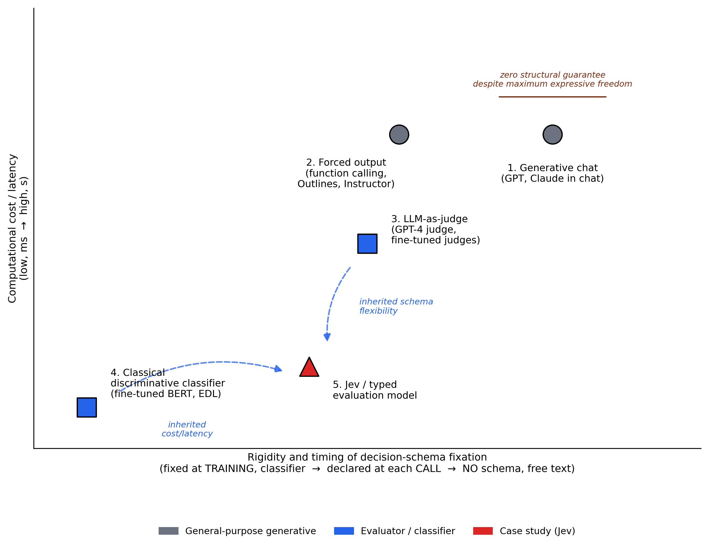

# Typed Evaluation Models and the Collapse Between Conflict and Ignorance: A Case Study on Jev

**Maikel Leyva-Vázquez**¹,²,³

¹ Universidad Bernardo O'Higgins (UBO), Santiago, Chile. ² Universidad Bolivariana del Ecuador (UBE), Guayaquil, Ecuador. ³ Universidad de Guayaquil, Guayaquil, Ecuador.

*Draft v0.3 (English) — target: NCML. Field note, not part of the author's own Q1 line. Revised after a 5-model adversarial review round and two follow-up experiments (enriched Choice, binary Choice).*

---

## Abstract

Chat-based LLMs return free text that must be interpreted; a category of tools that emerged in September 2026, *typed evaluation models* ("System One models"), instead return a typed object directly usable by software. Jev (TypeSafe AI, reported by the vendor as launched on September 15, 2026) is the first commercial example of this category. This work situates it within a five-category landscape of AI model interaction and tests, with a minimal experiment, a prediction derived from annotated decision theory: that an output collapsed to a single calibrated probability cannot distinguish *genuine conflict* from *genuine ignorance*. For Jev's simplest question type (`boolean`/Noul), the experiment is consistent with that prediction: conflict cases (probability 0.50–0.57) and ignorance cases (0.46–0.48) fall within the same narrow band, indistinguishable without further context. But a second experiment, using the same model's `Choice` type with a schema that explicitly names "conflicting evidence" and "insufficient evidence" as options, separates both cases with probability 1.0 in all four completed cases. A third experiment, with `Choice` restricted to the two original options (`red`/`green`, no escape categories), reproduces neither the ~0.5 collapse of the first experiment nor the clean separation of the second: a directional bias toward "red" appears (0.67–0.85 depending on the case) that correlates with the lexical presence of the word "red" in the state, not cleanly with the TORN/SILENT category. The central finding, therefore, is not that Jev collapses per se, but that **the same model preserves, destroys, or unpredictably distorts the distinction depending on the question type and the declared schema** — an interface design risk more complex than a single follow-up experiment could anticipate. Implications for anyone building on typed evaluation models are discussed, and concrete open questions for future work are identified.

**Keywords:** typed evaluation models; System One models; LLM-as-judge; annotated paraconsistent logic; representational collapse; typed abstention; Jev.

---

## 1. Introduction

A conventional chat model, faced with the question "was the refund approved?", might answer "Yes, it seems so, although I'm not entirely sure..." — an unstructured string of text that the consuming software must re-parse or interpret, with no explicit score and no format guarantee. A category of tools that emerged in September 2026, *typed evaluation models*, inverts that relationship: the model is given a *state* (the available context or evidence) and a schema of *questions*, each with a declared type, and the model returns, for each question, a value of that type together with a calibrated probability.

TypeSafe AI calls its first model of this kind "System One" — the fast, intuitive counterpart to the slow, deliberate reasoning ("System Two") pursued by frontier LLMs [1]. According to the vendor, Jev does not generate text: it selects among the options of a schema supplied by the caller, so returning a malformed value or one outside the declared set would be structurally impossible [2] — a format guarantee, not a guarantee of content correctness. The vendor reports 20 to 200 times more speed and up to 400 times lower cost than a frontier LLM for this class of tasks [3], and a proprietary training method, *Reinforcement Learning for Calibrated Decisions* (RLCD), aimed at explicit calibration [4]. None of these figures were independently audited in this work; they are reported as vendor claims, not as verified facts.

This work does not evaluate Jev's performance on its intended tasks. Before examining it as a case study (§3–§6), §2 situates it within a broader landscape of AI model interaction categories. A representational question is then examined — what does a model that collapses evidence to a single calibrated probability lose? — and, following an unexpected finding in the experiment itself, that question is refined into a more precise one: **is the loss a property of the model, or of the type of interface chosen to query it?**

## 2. Landscape of AI Model Interaction Categories

The binary opposition "free chat vs. typed" oversimplifies the real landscape. Figure 1 positions five categories along two axes: computational cost and **rigidity/timing of the decision schema's fixation** — not "input flexibility," a formulation from an earlier version of this figure that led to a misreading (it suggested that a generative chat model was *less* flexible than a typed model, when it is exactly the opposite in terms of what it can be asked). The correct axis runs from a schema fixed at **training** time (category 4, the most rigid) to a schema declared at each **call** (categories 2, 3, and 5), to the total absence of a schema (category 1, free text — the maximum possible expressive freedom, but with zero structural guarantee on the response).

1. **Generative chat models** — free text, no guarantee of format or type. This is the *no-schema* extreme of the axis: it accepts any question, but offers no guarantee about the shape of the answer.
2. **LLM with forced output (*constrained decoding*)** — still a general-purpose generative model underneath, but at each generation step the space of valid tokens is restricted according to a declared grammar or JSON schema [12]. The cost remains that of a full LLM.
3. **LLM-as-judge** — a frontier or fine-tuned LLM evaluates according to a natural-language criterion. When fine-tuned to a specific task, the literature documents that it can degenerate into a closed-domain classifier, with a performance drop outside that domain [13].
4. **Classical discriminative classifiers** — dedicated non-generative architectures (e.g., a fine-tuned BERT, or an evidential head such as EDL), deterministic, with a class schema fixed at training time. Reported as substantially cheaper and faster than an LLM-based judge, although the exact figure varies by source and is not taken here as precise data.
5. **Jev and its peers (typed evaluation models)** — the case study of this work.

**Note on this taxonomy:** it is not a strict partition. Categories 2 and 3 can overlap in practice — an LLM-based judge can use forced output to guarantee a valid JSON verdict — and are presented as heuristic axes (use, decoding technique, architecture, cost) rather than as mutually exclusive classes. It is the author's own synthesis of secondary sources, not a systematic review of the constrained-decoding and LLM-as-judge literature.

With that caveat, Jev sits at the convergence of categories 3 and 4: it inherits from category 3 the flexibility of a question schema declared at call time, and from category 4 the low cost and the guarantee of typed output by construction. The LLM evaluation ecosystem is converging toward two-tier architectures in 2026 — a cheap classifier that resolves most cases and escalates to a frontier judge only when the case is ambiguous [14] — which is, structurally, the same cascade that a typed-abstention taxonomy already formalizes for decision-making under insufficient or disputed evidence (the author's own unpublished research-program synthesis; see note in §7).



**Figure 1.** Positioning of the five AI model interaction categories according to schema rigidity/timing (x-axis: fixed at training → declared at each call → no schema) and computational cost (y-axis). Jev sits at the convergence between the LLM-based judge (category 3) and the classical discriminative classifier (category 4); generative chat (category 1) occupies the *no-schema* extreme — maximum expressive freedom, zero structural guarantee. Source: own elaboration.

## 3. Verified Taxonomy of Types in Jev

The vendor's documentation [8] specifies three question primitives, evaluable in parallel within a single call:

| Type | What it does | What it returns |
|---|---|---|
| **Choice** | pick one option from a declared set (`criteria`: option→description map) | chosen option + probability per option |
| **Score** | rate the state on a rubric of ordered levels | score + probability per level |
| **Noul** | yes/no question | the probability that the answer is "yes" |

The documentation calls the third type "Noul," not "Boolean," and describes it as a continuous probability in [0,1] — not a discrete value. The Vercel AI Gateway SDK, which exposes `experimental_evaluate` as the access interface, names that same type `boolean` in its API signature [9]. Verified directly against the response object (§5): the field `providerMetadata.typesafe.confidence` exists in the schema but arrives **empty (`{}`)** in all five cases run with the `boolean` type — there is, for that type, no additional confidence or evidence-composition field beyond the single probability.

## 4. The Representational Question

In the annotated paraconsistent logic framework (LPA2v) [10], a judgment is represented as an independent pair (μ, λ). Two distinguished vertices of the resulting lattice, **⊤** (inconsistent: strong evidence in both directions) and **⊥** (paracomplete: absence of evidence in either direction), are epistemologically opposite but share a geometric property: both are equally far from the "true" and "false" ideal vertices [11]. From this a result already formalized follows: every closeness score to those ideal vertices is invariant under the involution that swaps ⊤ and ⊥ [11].

This work does not apply that theorem literally to Jev — doing so would require Jev to explicitly compute an independent pair (μ, λ), which is undocumented. The connection is a motivating analogy, not a deductive consequence of the theorem. The argument that *is* deductively valid, and that this work puts to the test, is simpler: **no map from an evidence space of two or more dimensions (support, opposition, magnitude, insufficiency) to a single scalar in [0,1] can be injective**; two distinct evidence states can, by pure cardinality, collapse to the same number. A model that exposes only that scalar — like Jev's Noul type — cannot, in principle, guarantee that conflict and ignorance produce distinct values.

## 5. Method

Six states (`state`) were designed in English on the same domain fact (whether a traffic light was red), in four categories: **TORN** (genuine conflict, n=2, two equally credible sources that contradict each other), **SILENT** (genuine ignorance, n=2, documented absence of evidence), **AGREE-SUPPORT** (control, n=1, sources agreeing on "red"), and **AGREE-REFUTE** (control, n=1, sources agreeing on "not red"). The full six states are available in the data repository (§10).

**Experiment 1 (`boolean`/Noul type):** one call per state to `typesafe-ai/jev` via `experimental_evaluate` from the `ai` SDK v7.0.107, single question: *"Was the traffic light red at the time in question?"*

**Experiment 2 (`Choice` type, follow-up):** the same six states, a single `lightState` question of type `choice` with four explicit options: `red`, `green`, `conflicting_evidence` ("reliable sources disagree with each other about the color"), and `insufficient_evidence` ("there is no evidence available to determine the color"). This second experiment was designed *after* observing the results of Experiment 1, prompted by an adversarial review that flagged the need to test whether the collapse was a property of the model or of the question type — it is explicitly declared as not preregistered and data-motivated.

**Experiment 3 (binary `Choice`, closing the open question):** the same six states, the same `lightState` question of type `choice`, but with **only** the two original options: `red` and `green`, no escape categories. Tests whether the perfect separation of Experiment 2 depends on the schema being *able* to name conflict/insufficiency, or whether it is a general property of the `Choice` type independent of the schema. Also data-motivated, not preregistered.

None of the three experiments averages repetitions (a single call per case; limitation in §8). The calls were made on September 19, 2026 against the production model, with no access to its weights or training set.

## 6. Results

**Experiment 1 — `boolean`/Noul type:**

| Case | Category | P(red) |
|---|---|---|
| TORN-1 | genuine conflict (contradictory witnesses) | 0.57 |
| TORN-2 | genuine conflict (contradictory sensors) | 0.50 |
| SILENT-1 | genuine ignorance (no witnesses or cameras) | 0.46 |
| SILENT-2 | genuine ignorance (lost record) | 0.48 |
| AGREE-SUPPORT | control: sources agree (support) | 0.83 |
| AGREE-REFUTE | control: sources agree (refutation) | no data (rate-limit, §8) |

The two TORN cases (0.50–0.57) and the two SILENT cases (0.46–0.48) fall within a common, narrow band. The only completed control with unambiguous evidence (AGREE-SUPPORT) yields 0.83, far from 0.5.

**Experiment 2 — `Choice` type with enriched schema:**

| Case | Category | Jev's choice | P(choice) |
|---|---|---|---|
| TORN-1 | genuine conflict | *conflicting_evidence* | 1.00 |
| TORN-2 | genuine conflict | *conflicting_evidence* | 1.00 |
| SILENT-1 | genuine ignorance | *insufficient_evidence* | 1.00 |
| SILENT-2 | genuine ignorance | *insufficient_evidence* | 1.00 |
| AGREE-SUPPORT | control: sources agree | *red* | 1.00 |
| AGREE-REFUTE | control: sources agree | no data (rate-limit, §8) | — |

With the `Choice` type and a schema that explicitly names "conflicting evidence" and "insufficient evidence" as first-class options, Jev separates the four experimental cases (TORN vs. SILENT) with maximum probability and no ambiguity, and correctly classifies the support control. The same textual evidence that collapsed to a 0.46–0.57 band under the `boolean` type produces a perfect distinction under the `Choice` type.

**Experiment 3 — binary `Choice` type (`red`/`green`, no escape categories):**

| Case | Category | P(red) | P(green) |
|---|---|---|---|
| TORN-1 | genuine conflict | 0.85 | 0.15 |
| TORN-2 | genuine conflict | 0.84 | 0.16 |
| SILENT-1 | genuine ignorance | 0.67 | 0.33 |
| SILENT-2 | genuine ignorance | 0.77 | 0.23 |
| AGREE-SUPPORT | control: sources agree | 1.00 | 0.00 |
| AGREE-REFUTE | control: sources agree | no data (rate-limit, §8) | — |

Without escape categories, Jev **does not** reproduce the ~0.5 collapse of Experiment 1 nor the perfect separation of Experiment 2. Instead, a directional bias toward `red` appears across all six cases, more pronounced in TORN (0.84–0.85) than in SILENT (0.67–0.77) — a weak ordinal trend (n=2 per category) that does not allow a firm conclusion. It is a third pattern, unanticipated by either of the two simple hypotheses (symmetric collapse or clean separation).

## 7. Discussion

The pattern in Experiment 1 is consistent with the prediction in §4: under the Noul type, Jev does not distinguish *why* the evidence is unclear. But Experiment 2 forces a correction of the interpretation: **the loss is not a property of the Jev model, but of the question type and schema declared to query it.** The `boolean` type forces, by definition, an output in a one-degree-of-freedom space — there is no way for it to return "conflict" or "insufficiency" even if the model internally distinguishes them. The `Choice` type, when the schema includes those categories as named options, does have representational room to express them, and the model exploits it with a sharpness that was not anticipated (probability 1.0, not a diffuse tendency).

This reframes the contribution of the work: it is not "Jev has an inherent representational limitation," but rather **"the design of the query schema determines whether the distinction survives, and the simplest, cheapest type to use (Noul, a single yes/no question) is precisely the one that destroys it by construction."** This is a usage risk, not a product engineering defect — and it is transferable to any system that, for convenience, reduces a complex decision to a yes/no question instead of a choice among a set of explicitly named epistemic states.

Experiment 3 answers the open question from v0.2 only partially, and in a more uncomfortable way than either of the two simple answers that were anticipated. The hypothesis "Choice always separates, regardless of the schema" is ruled out: without escape categories, there is no clean separation (0.84 is not 1.00, and SILENT does not approach 0.5 from the other side). But the alternative hypothesis "without escape categories, Choice collapses just like Noul" is also ruled out: there is no symmetric collapse toward 0.5 in any case — all values, including the SILENT cases with no evidence whatsoever, lean toward `red`.

The most honest explanation available with this data, without over-interpreting an n=2 per cell, is a possible **lexical confound in the design of the stimulus itself**: the TORN and AGREE-SUPPORT states literally contain the word "red" in the text (someone asserts it, even if it is contested), while the SILENT states do not mention either "red" or "green" at all. If the model partly weighs the surface presence of the word naming an option — and not only whether that assertion is credible or disputed — that would produce exactly the observed pattern: bias toward `red` in every case where the word appears (TORN, AGREE-SUPPORT), attenuated but not eliminated when it does not appear at all (SILENT). This explanation is plausible and testable, but this work did not test it in a controlled way (it would require, for example, reversing which option is named first in the state text, or constructing SILENT states that do mention both words without real evidence) — it remains a genuine open question, not a closed finding.

What does hold up across the three experiments together: the deductive argument in §4 (no single scalar can be injective over a higher-dimensional evidence space) explains the collapse of the Noul type, but **does not predict or explain** the pattern of Experiment 3 — a `Choice` with two options is not a single injective scalar in the same way, and yet it failed to achieve the separation that its representational space (two degrees of freedom, with probabilities summing to 1) would in principle allow. The cause there is more likely a model or stimulus-design artifact than a necessary representational limitation. The practical recommendation stands, but becomes more cautious: to preserve the distinction between conflict and ignorance, avoiding the `boolean` type is not enough — the `Choice` schema must also explicitly name those states as first-class options, and it is worth empirically verifying that the model is not responding to superficial lexical cues in the state rather than to the actual structure of the evidence.

## 8. Limitations

(a) n=5 completed cases out of 6 in each of the three experiments (the AGREE-REFUTE control failed due to the Vercel AI Gateway free tier's rate limit **in all three**, even with a payment method already on file — the provider requires loaded paid credits, not just a card on file, and that step was not completed; it is the only case that could never be observed, under any condition, and its absence is costliest in Experiment 3, where it would have been the most direct test of whether the bias toward `red` has a ceiling); (b) a single call per case in each experiment, with no repetition to estimate variance — critical for Experiment 3, whose pattern (n=2 per category) does not allow distinguishing a real trend from sample noise; (c) Experiments 2 and 3 were motivated by prior results and were not preregistered — explicitly declared as such; (d) the lexical-bias explanation for Experiment 3 (§7) is plausible but was not tested in a controlled way (this would require reversing the order in which options are mentioned in the text, or SILENT states that mention both words); (e) this is a four-day-old product at the time of writing — its behavior, documentation, and rate limits may change without notice, and these results should be read as a snapshot of 2026-09-19, not a stable characterization; (f) the speed, cost, and training-method (RLCD) figures are vendor claims, not independently audited in this work; (g) the five-category taxonomy in §2 is the author's own synthesis, not a systematic review.

## 9. Conclusion

The first experiment in this work seemed to confirm that typed evaluation models inherit, by representational design, the collapse between conflict and ignorance already formally characterized in annotated decision theory. A second experiment showed that conclusion to be incomplete: the same model, with a `Choice` schema that explicitly names the disputed epistemic states, separates conflict from ignorance with maximum probability. A third experiment, designed to isolate whether that separation depended on the schema or on the question type, showed that reality is messier than either of those two stories: without escape categories, Jev neither collapses symmetrically nor separates cleanly, but instead exhibits an unanticipated directional bias, possibly tied to superficial lexical cues in the input text.

The lesson that survives all three experiments is not about a fixed limit of Jev as a product, but about two distinct and equally real risks for anyone building on typed evaluation models: first, reducing an epistemically complex decision to the simplest available interface type (`boolean`/Noul) discards information by construction; second, even a more expressive interface (`Choice`) can fail in non-obvious ways — biased, not simply "less informative" — when the schema does not explicitly name the states that matter. No new architecture or theoretical extension is strictly necessary for the first risk; the second demands, at minimum, case-by-case empirical validation before trusting that a richer type solves the problem on its own.

---

## 10. References and Data

**References**

[1] TypeSafe AI. *Introducing System One Models & Jev*. TypeSafe AI Blog, 2026-09-15. https://typesafe.ai/blog/introducing-system-one-models-and-jev

[2] DataCamp. *Jev: TypeSafe's System One Model That Never Hallucinates*. https://www.datacamp.com/blog/system-one-models-jev

[3] Vercel. *TypeSafe AI's Jev now available on AI Gateway*. Vercel Changelog. https://vercel.com/changelog/typesafe-ai-jev-now-available-on-ai-gateway

[4] explainx.ai. *How Does Jev Work? RLCD & Parallel Inference Explained*. 2026. https://www.explainx.ai/blog/how-does-jev-work-rlcd-system-one-model-explained-2026

[5] Mapika. *decider: One-pass typed decisions with calibrated probabilities, fine-tuned from Qwen3.5-2B*. GitHub. https://github.com/Mapika/decider

[6] nateGeorge. *reflex: A small open decision model — a Jev / System One re-creation on Qwen3.5*. GitHub. https://github.com/nateGeorge/reflex

[7] Eliot, L. *New 'Reinforcement Learning For Calibrated Decisions' Makes AI Headlines But Look Past The Hype*. Forbes, 2026-09-18.

[8] TypeSafe AI. *Introduction — Question Types*. https://docs.typesafe.ai/introduction

[9] Vercel. *Jev API, Pricing & Playground*. AI Gateway Models. https://vercel.com/ai-gateway/models/jev

[10] da Costa, N.C.A., Abe, J.M., Subrahmanian, V.S. (1991). Remarks on annotated logic. *Zeitschrift für Mathematische Logik und Grundlagen der Mathematik*, 37.

[11] Leyva-Vázquez, M. (2026). *Conflation-Invariant TOPSIS Scores and Panel-Level Abstention in Annotated Evidence* [manuscript in preparation]. Preprint SSRN 7441661.

[12] Park, K., Zhou, T., D'Antoni, L. (2025). *Flexible and Efficient Grammar-Constrained Decoding*. arXiv:2502.05111. Also in Proceedings of the 42nd International Conference on Machine Learning (ICML 2025).

[13] Huang, H., Bu, X., Zhou, H., Qu, Y., Liu, J., Yang, M., Xu, B., Zhao, T. (2024). *An Empirical Study of LLM-as-a-Judge for LLM Evaluation: Fine-tuned Judge Model is not a General Substitute for GPT-4*. arXiv:2403.02839. Accepted at Findings of ACL 2025.

[14] Gu, J., Jiang, X., Shi, Z., Tian, H., Zhai, X., Xu, C., et al. (2026). *A survey on LLM-as-a-judge*. **The Innovation**, 7(6), 101253. https://www.sciencedirect.com/science/article/pii/S2666675825004564

**Data and code:** public repository — https://github.com/mleyvaz/jev-typed-evaluation-collapse — with `run_experiment.mjs` + `results.json` (Experiment 1), `run_experiment_choice.mjs` + `results_choice.json` (Experiment 2), `run_experiment_choice_binary.mjs` + `results_choice_binary.json` (Experiment 3), and `make_fig1_taxonomy.py` (Figure 1). Reproducible with the reader's own AI Gateway key.

---

## Appendix A. Input States (verbatim)

The six states (`state`) used across the three experiments, identical in each — only the declared question (`questions`) changes.

**TORN-1** (genuine conflict):
> Witness A, a police officer with a clear view of the intersection, testified under oath that the traffic light was red at the moment of the collision. Witness B, a bystander standing next to Witness A with an equally clear view, testified under oath that the same traffic light was green at that exact moment. Both witnesses are considered reliable by the investigating officer; there is no indication either one is lying.

**TORN-2** (genuine conflict):
> Sensor 1, a calibrated high-precision traffic sensor, recorded the light as RED at 14:03:02. Sensor 2, an equally calibrated high-precision sensor mounted on the same pole, recorded the light as GREEN at the same timestamp, 14:03:02. Both sensors passed their most recent calibration check with no faults reported.

**SILENT-1** (genuine ignorance):
> No witnesses were present at the intersection at the time in question. No traffic cameras were operating in that area that day. There is no record, sensor log, or testimony of any kind describing the state of the traffic light at that moment.

**SILENT-2** (genuine ignorance):
> The traffic light's camera log for that day was permanently lost in a server failure before any backup was made. No witnesses have come forward. No other observation of the light exists in any form.

**AGREE-SUPPORT** (control, support):
> Witness A testified that the traffic light was red at the time of the collision. Witness B, standing nearby with an independent line of sight, separately and independently confirmed that the light was red at that same moment.

**AGREE-REFUTE** (control, refutation):
> Witness A testified that the traffic light was green, not red, at the time of the collision. Witness B, standing nearby with an independent line of sight, separately and independently confirmed that the light was green at that same moment.

## Appendix B. Call Code, per Experiment

**Experiment 1 (`boolean`/Noul):**
```js
import { experimental_evaluate as evaluate } from 'ai';

const result = await evaluate({
  model: 'typesafe-ai/jev',
  state: STATE_TEXT, // one of the six states in Appendix A
  questions: {
    wasRed: {
      type: 'boolean',
      instructions: 'Was the traffic light red at the time in question?',
    },
  },
});
```

**Experiment 2 (`Choice`, enriched schema):**
```js
const result = await evaluate({
  model: 'typesafe-ai/jev',
  state: STATE_TEXT,
  questions: {
    lightState: {
      type: 'choice',
      instructions: 'What was the state of the traffic light at the time in question?',
      criteria: {
        red: 'The evidence indicates the light was red.',
        green: 'The evidence indicates the light was green (not red).',
        conflicting_evidence: 'Reliable sources disagree with each other about the color.',
        insufficient_evidence: 'There is no evidence available to determine the color.',
      },
    },
  },
});
```

**Experiment 3 (binary `Choice`, no escape categories):**
```js
const result = await evaluate({
  model: 'typesafe-ai/jev',
  state: STATE_TEXT,
  questions: {
    lightState: {
      type: 'choice',
      instructions: 'What was the state of the traffic light at the time in question?',
      criteria: {
        red: 'The evidence indicates the light was red.',
        green: 'The evidence indicates the light was green (not red).',
      },
    },
  },
});
```

## Appendix C. Full Response (`answers`) per Case

The `answers` object returned by Jev for each completed case, unedited (the full response object also includes `usage`, `warnings`, `rounding`, and `providerMetadata`, available in the `results*.json` files in the repository).

**Experiment 1 — `boolean`/Noul:**
```json
TORN-1:         {"wasRed":{"type":"boolean","probability":0.57}}
TORN-2:         {"wasRed":{"type":"boolean","probability":0.50}}
SILENT-1:       {"wasRed":{"type":"boolean","probability":0.46}}
SILENT-2:       {"wasRed":{"type":"boolean","probability":0.48}}
AGREE-SUPPORT:  {"wasRed":{"type":"boolean","probability":0.83}}
AGREE-REFUTE:   ERROR — GatewayRateLimitError (free-tier rate limit, §8)
```

**Experiment 2 — enriched `Choice`:**
```json
TORN-1:         {"lightState":{"type":"choice","choice":"conflicting_evidence",
                  "probabilities":{"red":0,"green":0,"conflicting_evidence":1,"insufficient_evidence":0}}}
TORN-2:         {"lightState":{"type":"choice","choice":"conflicting_evidence",
                  "probabilities":{"red":0,"green":0,"conflicting_evidence":1,"insufficient_evidence":0}}}
SILENT-1:       {"lightState":{"type":"choice","choice":"insufficient_evidence",
                  "probabilities":{"red":0,"green":0,"conflicting_evidence":0,"insufficient_evidence":1}}}
SILENT-2:       {"lightState":{"type":"choice","choice":"insufficient_evidence",
                  "probabilities":{"red":0,"green":0,"conflicting_evidence":0,"insufficient_evidence":1}}}
AGREE-SUPPORT:  {"lightState":{"type":"choice","choice":"red",
                  "probabilities":{"red":1,"green":0,"conflicting_evidence":0,"insufficient_evidence":0}}}
AGREE-REFUTE:   ERROR — GatewayRateLimitError (free-tier rate limit, §8)
```

**Experiment 3 — binary `Choice`:**
```json
TORN-1:         {"lightState":{"type":"choice","choice":"red","probabilities":{"red":0.85,"green":0.15}}}
TORN-2:         {"lightState":{"type":"choice","choice":"red","probabilities":{"red":0.84,"green":0.16}}}
SILENT-1:       {"lightState":{"type":"choice","choice":"red","probabilities":{"red":0.67,"green":0.33}}}
SILENT-2:       {"lightState":{"type":"choice","choice":"red","probabilities":{"red":0.77,"green":0.23}}}
AGREE-SUPPORT:  {"lightState":{"type":"choice","choice":"red","probabilities":{"red":1,"green":0}}}
AGREE-REFUTE:   ERROR — GatewayRateLimitError (free-tier rate limit, §8)
```
